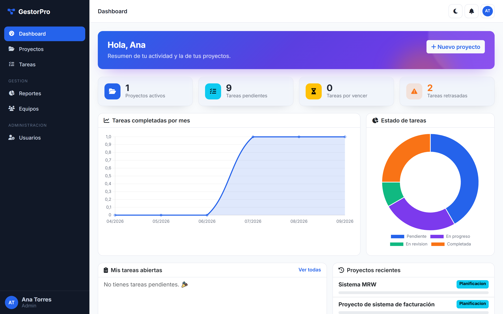
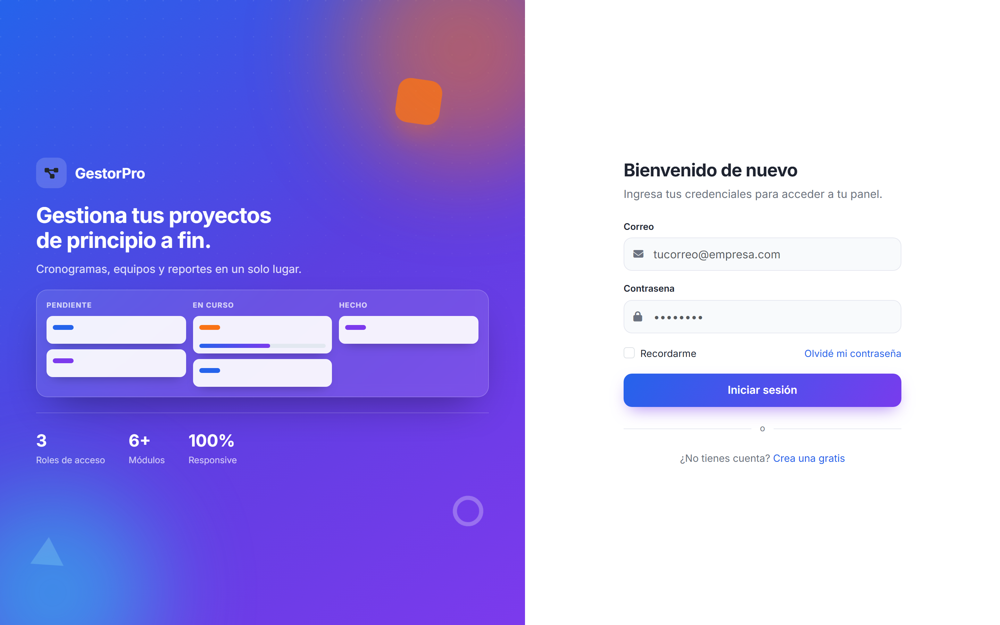
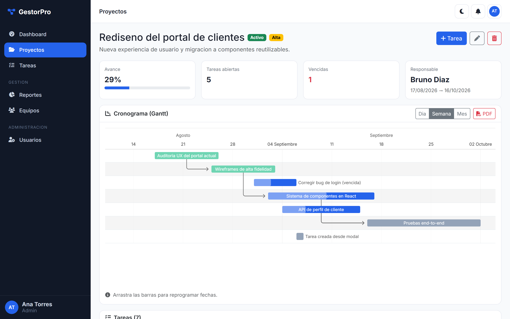
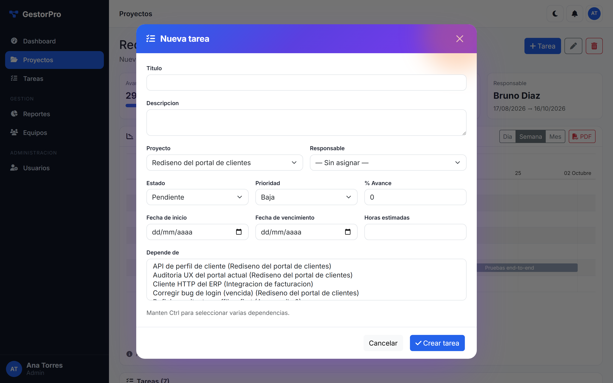
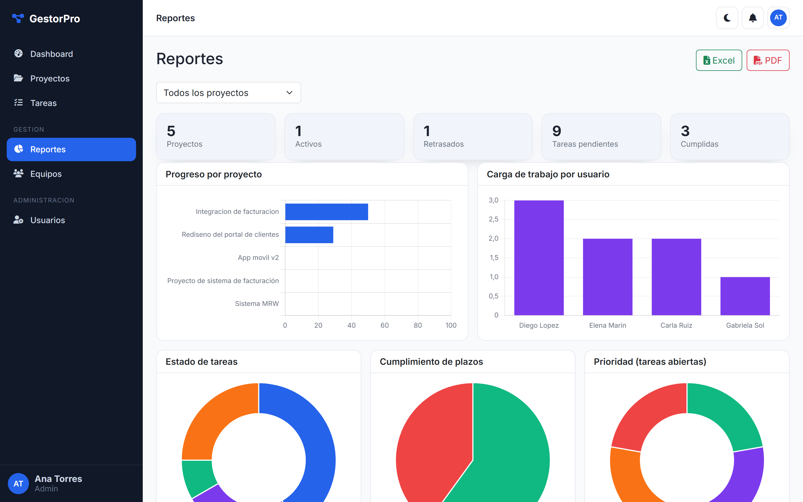

<div align="center">

# 🗂️ GestorPro

### Plataforma de gestión de proyectos, tareas y equipos — construida de principio a fin con Flask

Cronograma de Gantt interactivo · Dashboard con métricas en vivo · Reportes exportables a PDF/Excel · Control de acceso por roles · Interfaz con modales AJAX y modo oscuro

<br>


</div>

<br>

<p align="center">
  
</p>

<br>

## 💡 Sobre el proyecto

**GestorPro** es una aplicación web completa para planificar y hacer seguimiento de proyectos: crear proyectos y tareas, asignarlas a equipos, visualizar el avance en un diagrama de Gantt, medir el cumplimiento de plazos y exportar reportes para presentar a dirección.

Lo desarrollé **sin frameworks de frontend**: solo Flask, Jinja2 y JavaScript puro, con una arquitectura **MVC** limpia (modelos, controladores como *blueprints*, servicios de negocio y vistas) y una capa de permisos por objeto y por rol.

<br>

## ✨ Funcionalidades

| Área | Detalle |
|------|---------|
| 📊 **Dashboard** | KPIs (proyectos activos, tareas pendientes / por vencer / retrasadas), gráfico de completadas por mes y anillo de estados, mis tareas y proyectos recientes |
| 📅 **Gantt interactivo** | Cronograma por proyecto con dependencias entre tareas, vistas Día / Semana / Mes y **arrastrar-y-soltar de fechas** persistido por API JSON |
| 🧾 **Reportes** | Progreso por proyecto, carga de trabajo por persona, cumplimiento de plazos y distribución de estados/prioridades · exportación a **Excel** (openpyxl) y **PDF** (ReportLab) |
| 🗒️ **CRUD en modales** | Alta/edición/baja de proyectos, tareas, equipos y usuarios **sin recargar la página**: formulario cargado por AJAX, validación del servidor mostrada dentro del modal y confirmaciones con *toast* |
| 🧭 **Cronograma en PDF** | Cada proyecto genera su Gantt como PDF vectorial (barras por estado, % de avance, marca de "hoy") |
| 🔐 **Autenticación** | Hash `pbkdf2:sha256`, sesiones con Flask-Login, protección CSRF, recuperación de contraseña por token con expiración y respuesta anti-enumeración |
| 🔔 **Notificaciones** | Al asignar o comentar tareas, más un *scanner* de vencimientos pensado para ejecutarse por cron |
| 🌗 **UI** | Bootstrap 5.3 + Font Awesome, modo claro/oscuro con variables CSS y preferencia guardada, sidebar que se adapta al rol y es colapsable en móvil |

<br>

## 🖼️ Capturas

<table>
  <tr>
    <td width="50%"><br><sub><b>Login</b> — pantalla dividida con ilustración animada de un tablero Kanban</sub></td>
    <td width="50%"><br><sub><b>Proyecto</b> — cronograma de Gantt con dependencias y exportación a PDF</sub></td>
  </tr>
  <tr>
    <td width="50%"><br><sub><b>Modales AJAX</b> — crear/editar sin salir de la página</sub></td>
    <td width="50%"><br><sub><b>Reportes</b> — gráficos con Chart.js y exportación a Excel/PDF</sub></td>
  </tr>
</table>

<br>

## 🛠️ Stack técnico

| Capa | Tecnologías |
|------|-------------|
| **Backend** | Python · Flask 3 · SQLAlchemy 2 · Flask-Login · Flask-WTF · Flask-Migrate · Flask-Mail |
| **Base de datos** | PostgreSQL (psycopg 3) · SQLite en memoria para los tests |
| **Frontend** | Jinja2 · Bootstrap 5.3 · JavaScript ES5 sin dependencias · Chart.js · Frappe Gantt |
| **Reportes** | openpyxl (Excel) · ReportLab (PDF + dibujo del Gantt) |
| **Calidad** | pytest · Gunicorn para producción |

<br>

## 🏗️ Arquitectura (MVC)

```
app/
├── __init__.py          application factory
├── config.py            configuración por entorno
├── extensions.py        db · login · csrf · mail · migrate
│
├── models/          ── M ──  SQLAlchemy: role, user, team, project, task, comment, notification
├── controllers/     ── C ──  blueprints: auth, dashboard, projects, tasks, teams, users, reports, api
├── services/                 lógica de negocio: report_service, export_service, notification_service, mail_service
├── forms/                    validación con Flask-WTF
├── utils/                    decoradores de rol · permisos de objeto · scoping · helpers de modales
│
├── templates/       ── V ──  Jinja2: base + partials + una carpeta por módulo (incl. `_form_modal.html`)
└── static/                   css/style.css (paleta + modo oscuro) · js/ (app, dashboard, gantt, reports, modal-form)

tests/                        pytest sobre SQLite en memoria
```

<br>

## 🔐 Roles y permisos

| Rol | Alcance |
|-----|---------|
| **Admin** | Todo: usuarios, equipos, todos los proyectos y reportes |
| **Gerente** | Sus proyectos y equipos, tareas y reportes |
| **Colaborador** | Solo las tareas asignadas y los proyectos donde participa |

El **menú lateral se genera según el rol** y el primer usuario registrado se vuelve `admin` automáticamente.

<br>

## 🚀 Puesta en marcha

```bash
git clone https://github.com/alcedoanggi-crypto/gestorpro.git
cd gestorpro

python -m venv .venv
.venv\Scripts\activate            # Windows   ·   source .venv/bin/activate en Linux/Mac
pip install -r requirements.txt

copy .env.example .env            # edita SECRET_KEY y DATABASE_URL
```

```sql
CREATE DATABASE gestorpro;        -- PostgreSQL
```

```bash
flask init-db                     # crea tablas + roles
flask seed                        # datos de demostración (opcional)
python wsgi.py                    # http://localhost:5000
```

**Usuarios de demo** (contraseña `Demo1234`):

| Correo | Rol |
|--------|-----|
| `admin@demo.com` | admin |
| `gerente@demo.com` | gerente |
| `diego@demo.com` | colaborador |

<br>

## 🧪 Tests

```bash
pytest
```

Se ejecutan sobre SQLite en memoria — no necesitan PostgreSQL.

<br>

---

<div align="center">

**Anggie Alcedo** · Desarrolladora de software

[](https://github.com/alcedoanggi-crypto)

</div>
